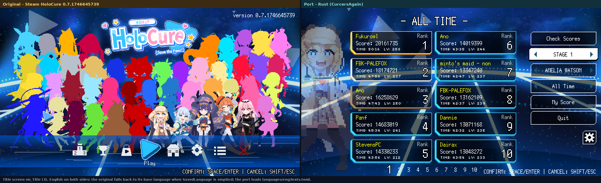
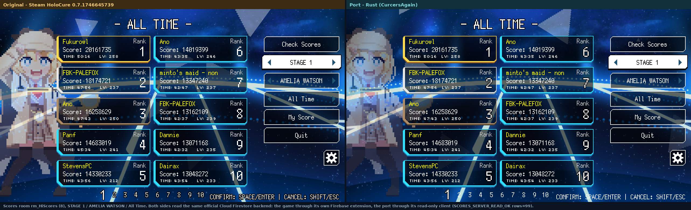

# CurersAgain - Rust port

A readable, modular Rust reconstruction of HoloCure's **HiScores** screen, with
parity **measured** against the retail Steam executable, plus the scripts used to
extract the original data.

## Status

The screen is measured, not guessed: sprite names, frames, positions, hitboxes,
text and colours come from live observation of the Steam build (see
`docs/measured-ui.md` (repo `rust-port/docs/`)). Remaining gaps are listed honestly in
`docs/parity-status.md`. **This is not a claim of a finished 1:1 clone.**

## Layout

```
(this crate)
src/scenes/scores.rs    rm_HiScores state, filters, navigation
src/render/scores.rs    drawing with measured sprites and positions
src/language.rs         external TOML language packs
src/score_server.rs     read-only transport to the official backend
src/native_save.rs      read-only original save reader
languages/              eng, es, id, jp text packs + layout limits
tests/                  conformance tests and SDL screenshots
docs/                   measurements, parity status, backend notes
```

## Build and run

```sh
cargo build --release
./run-title-reference.sh /path/to/extracted/assets
```

`HOLOCURE_ASSET_ROOT` must point at the extracted original sprites and fonts; they
are **not** redistributed here.

To read the official leaderboard (opt-in, read-only):

```sh
HOLOCURE_FIREBASE_CONFIG=/path/to/public-client-config.json HOLOCURE_OPEN_SCORES=1 ./target/release/title_reference /path/to/assets
```

`cargo run --bin menu` opens the separate title-menu lab prototype; it uses
placeholder art and is not the Scores screen.

## Safety model

- Reads only. No publishing, renaming or deletion on the server.
- The transport keeps a URL allow-list and rejects anything else.
- Interface buttons work completely on the client side; remote writes are skipped
  and logged (`remote_write=skipped`).
- The original game installation, saves and mods are never modified.

## Parity captures

Both images were taken from live windows with `XGetImage`; no game memory was
read, and all text is English on both sides. The original shows English because
emptying `SavedLanguage` makes it fall back to its base language; the port loads
`languages/eng/texts.toml`.

### Title screen `rm_Title (3)`



The eight title icons sit at logical `x = 170 + i*50` with the row at logical
`y = 305`: measured on the original and reproduced here.

### Scores room `rm_HiScores (8)` - STAGE 1 / AMELIA WATSON / All Time



Both sides show the **same** rows from the **same** official Cloud Firestore
backend: the original through its own Firebase extension, the port through the
read-only client in `src/score_server.rs` (`SCORES_SERVER_READ_OK rows=99`).

Not shown as parity: triangles replay a captured schedule because the original
RNG sequence is not recovered, particles/shaders/sparkles are incomplete, and the
character-select room is not ported. `docs/parity-status.md` keeps the honest list.

## Tests

```sh
cargo test --all-targets
HOLOCURE_ASSET_ROOT=... HOLOCURE_TEST_OUTPUT=... cargo test --test scores_sdl -- --ignored
```
